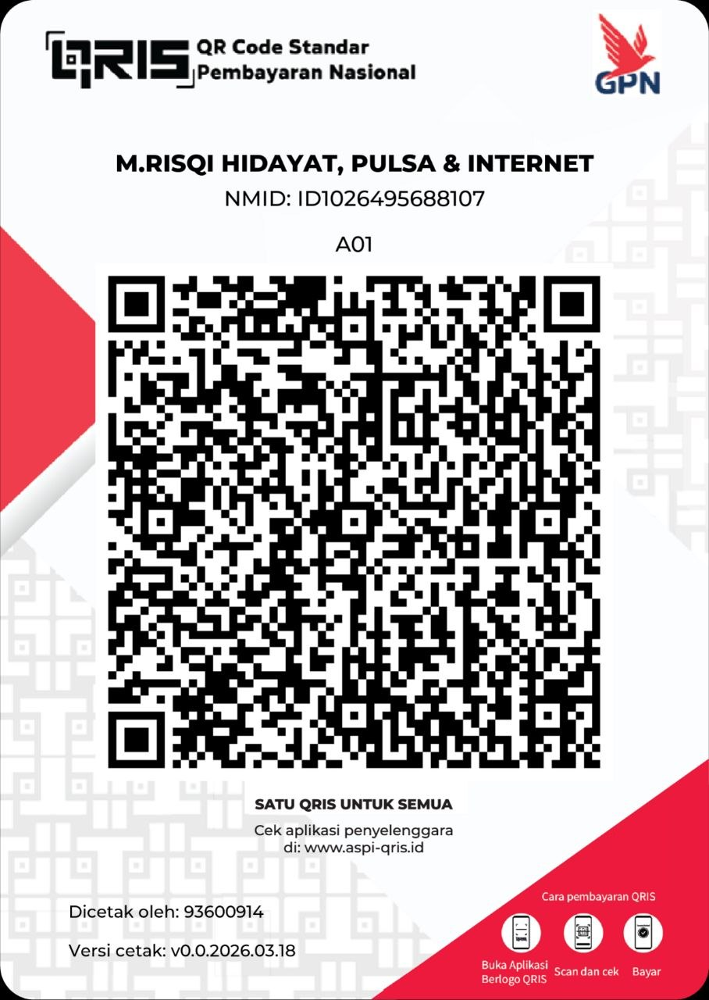

# Cloudflare ACM Certificate via SSL for SaaS (Custom Hostnames)
## Metode Terbaru 2026 — Gratis 100 Hostname

> ⚠️ **PERINGATAN KERAS!**
> 
> METHOD INI GRATIS. JANGAN DIJUAL BELIKAN, JANGAN DIPERJUALBELIKAN.
> 
> Siapa pun yang ketauan jual method ini, semoga rezekinya seret, akunnya kena banned massal, dan hidupnya ga berkah. Ini ilmu gratis buat sharing, bukan buat cari untung di atas kebodohan orang lain.
> 
> **KALO LU JUAL METHOD INI, LU ANJING.**

---

## Daftar BIN Credit Card

Bisa dipake buat verifikasi payment method Cloudflare (auth $1, direfund):

```
4463340000856
42588164012
55988805
```

Generate CC lengkap di [chckr.cc](https://chckr.cc) atau [namso-gen.com](https://namso-gen.com).

---

## Prasyarat
- Akun Cloudflare (free)
- Payment method terverifikasi (CC/PayPal/Google Pay — tidak dipotong)
- Domain sendiri di Cloudflare

---

## STEP 1: Tambah Payment Method

> **Navigasi:** Dashboard → **Billing** (menu kiri) → **Payment Methods**

1. Buka `https://dash.cloudflare.com/<ACCOUNT_ID>/billing/payment`
2. Klik **Add Payment Method**
3. Pilih Credit Card / PayPal 
4. Isi detail kartu (Gunakan Credit Card ini 5598880520345093|07|2029|870 atau generate menggunakan bin 55988805 di chckr.cc)
5. Cloudflare auth ~$1 (direfund otomatis)
6. Status: ✅ Verified

---

## STEP 2: Setup Fallback Origin + DNS (PER DOMAIN!)

> ⚠️ **Fallback Origin wajib di-set di SETIAP domain (zone), bukan per akun.**
> Kalo lu punya 3 domain, harus setup 3x.

### 2a. Buat DNS Record

**DNS → Records → Add Record:**

**Record 1 — Fallback Origin:**
```
Type: A
Name: fallback
IPv4: <IP VPS tunnel>
Proxy: ✅ ON (oranye)
```

**Record 2 — Wildcard Tunnel:**
```
Type: A
Name: *
IPv4: <IP VPS tunnel>
Proxy: ✅ ON (oranye)
```
> ⚡ Record `*` bikin semua subdomain auto-resolve ke tunnel. Ga perlu tambah DNS lagi per hostname.
> ⚠️ **Proxy ON** — karena pake TXT validation, DNS bisa langsung ngarah ke tunnel tanpa perlu ganti-ganti.

### 2b. Set Fallback Origin di Custom Hostnames

> **Navigasi:** Klik domain → **SSL/TLS** (menu kiri) → **Custom Hostnames**

Isi form:
```
Fallback Origin: fallback.domain-anda.my.id
```
Klik **Add Fallback Origin**

✅ Error "zone does not have a fallback origin" hilang

---

## STEP 3: Bikin Custom Hostname

> ⚡ **TXT Validation = TIDAK BUTUH VPS.** Cuma tambah TXT record di DNS.
> ⚡ **HTTP Validation = BUTUH VPS nginx.** Buat yg mau otomatisasi penuh.

Ada 2 metode validasi. Bedanya:

| | TXT Validation | HTTP Validation |
|---|---|---|
| Perlu VPS nginx? | ❌ Tidak | ✅ Ya |
| Perlu ganti DNS? | ❌ Tidak | ✅ Ya (proxy OFF → ON) |
| Perlu tambah record? | ✅ 2 TXT record manual | ❌ Otomatis |
| Cocok buat? | Tunnel/pakai langsung | Otomatisasi bot |

### Metode A — TXT Validation (RECOMMENDED) ⭐

**Cara kerja:** Cloudflare baca TXT record dari DNS lu. **Ga perlu VPS, ga perlu install apa-apa, ga perlu ganti IP.**

> **Navigasi:** Klik domain → **SSL/TLS** → **Custom Hostnames** → **Add Custom Hostname**

**Step by step:**

1. **Buka Custom Hostnames:**
   Klik domain → **SSL/TLS** → **Custom Hostnames**

2. **Klik Add Custom Hostname,** isi form:
   - **Custom Hostname:** `api.quipper.com.do.domain-anda.my.id`
   - **Minimum TLS:** `1.2`
   - **Certificate validation method:** `TXT Validation`
   - **SSL certificate authority:** `Google Trust Services`

3. **Klik Add Hostname** — Cloudflare kasih 2 TXT record:
   ```
   TXT Name:  _acme-challenge.api.quipper.com.do
   TXT Value: Zdv7HaajoOkZp-voNIOjjhTXNtTwccW4lkEJSIz_9JA

   TXT Name:  _cf-custom-hostname.api.quipper.com.do
   TXT Value: 7d20defa-5ba7-46e2-bc82-792c33955f35
   ```

4. **Tambah TXT record di DNS:**
   Buka **DNS → Records → Add Record:**
   ```
   Type: TXT
   Name: _acme-challenge.api.quipper.com.do
   Content: Zdv7HaajoOkZp-voNIOjjhTXNtTwccW4lkEJSIz_9JA
   TTL: Auto

   Type: TXT
   Name: _cf-custom-hostname.api.quipper.com.do
   Content: 7d20defa-5ba7-46e2-bc82-792c33955f35
   TTL: Auto
   ```

5. **Tunggu 2-5 menit** — status berubah jadi **Active** 🟢

6. **Pakai certificatenya:**
   Tambah DNS record buat domain tunnel:
   ```
   Type: CNAME
   Name: api.quipper.com
   Target: api.quipper.com.do.domain-anda.my.id
   Proxy: ✅ ON
   ```
   SSL/TLS mode: **Full (strict)**

> ✅ **TXT = ga ribet.** DNS tunnel langsung ngarah ke VPS, ga perlu diubah-ubah. Cuma tambah TXT record doang.

### Metode B — HTTP Validation (buat otomatisasi)

**Cara kerja:** Cloudflare kirim HTTP request ke server lu. **Butuh VPS + nginx + DNS diubah proxy OFF.**

> ⚠️ **Kelemahan:** DNS harus proxy OFF saat validasi, lalu ganti ke proxy ON setelah cert active. Ribet kalo manual. Cocok buat bot/otomatisasi.

**Step by step:**

1. **Sediakan VPS + install nginx:**
   ```bash
   apt install nginx -y
   mkdir -p /var/www/acme/.well-known/acme-challenge

   cat > /etc/nginx/sites-enabled/acme-challenge << 'EOF'
   server {
       listen 80;
       server_name _;

       location /.well-known/acme-challenge/ {
           root /var/www/acme;
           try_files $uri =404;
       }

       location / {
           return 200 "OK";
           add_header Content-Type text/plain;
       }
   }
   EOF

   nginx -t && systemctl restart nginx
   ```

2. **Ganti DNS sementara:**
   DNS `*` → **proxy OFF** (abu-abu) — ngarah ke VPS nginx

3. **Bikin custom hostname via API:**
   ```bash
   curl -X POST "https://api.cloudflare.com/client/v4/zones/$ZONE/custom_hostnames" \
     -H "Authorization: Bearer ***     -H "Content-Type: application/json" \
     -d '{"hostname":"api.quipper.com.do.domain.my.id","ssl":{"method":"http","type":"dv"}}'
   ```

4. **Tunggu validasi** — Cloudflare kirim HTTP request ke nginx VPS → 2-5 menit

5. **Setelah cert ACTIVE, balikin DNS:**
   DNS `*` → **proxy ON** (oranye) — ngarah ke VPS tunnel

> ⚠️ Ribet. Mending pake **Metode A (TXT)** kalo ga perlu otomatisasi.

---

## STEP 4: Dapatkan API Token

1. **Profile (ikon user)** → **API Tokens**
2. **Create Token** → **Create Custom Token**
3. Permission:
   - `Zone → DNS → Edit`
   - `Zone → SSL and Certificates → Edit`
4. Zone Resources: Include → Specific zone → `domain-anda.my.id`
5. Copy token

### Dapatkan Zone ID
Buka dashboard domain → scroll bawah kanan → **Zone ID**

---

---

## 1 Domain Banyak VPS (Custom Origin)

Kalo punya 3 VPS tapi cuma 1 domain, pake `custom_origin_server` biar tiap hostname ngarah ke VPS berbeda.

```
domain.my.id
├── vps1.domain.my.id  → custom_origin: 1.1.1.1  (VPS 1)
├── vps2.domain.my.id  → custom_origin: 2.2.2.2  (VPS 2)
└── vps3.domain.my.id  → custom_origin: 3.3.3.3  (VPS 3)
```

**Bikin custom hostname dengan custom origin:**
```bash
curl -X POST "https://api.cloudflare.com/client/v4/zones/$ZONE/custom_hostnames" \
  -H "Authorization: Bearer ***  -H "Content-Type: application/json" \
  -d '{
    "hostname":"vps1.domain.my.id",
    "ssl":{"method":"txt","type":"dv"},
    "custom_origin_server":"1.1.1.1"
  }'
```

**Response:**
```json
{
  "success": true,
  "result": {
    "id": "xxx",
    "hostname": "vps1.domain.my.id",
    "custom_origin_server": "1.1.1.1",
    "ssl": { "status": "pending_validation" }
  }
}
```

> ⚡ `custom_origin_server` override default fallback origin. Jadi tiap hostname bisa ngarah ke VPS berbeda tanpa ganti-ganti DNS.

**DNS setup (sekali):**
```
DNS → Records:
  A  vps1  → 1.1.1.1  (proxy ON)
  A  vps2  → 2.2.2.2  (proxy ON)
  A  vps3  → 3.3.3.3  (proxy ON)
```

---

## API Endpoints

### Flow Lengkap:

```
1. GET  /zones/:zone/dns_records                    → cek record "fallback"
      POST /zones/:zone/dns_records                 → bikin kalo belum ada
2. PUT  /zones/:zone/custom_hostnames/fallback_origin → set fallback origin
3. POST /zones/:zone/custom_hostnames               → bikin custom hostname
4. POST /zones/:zone/dns_records                    → tambah TXT validation records
5. GET  /zones/:zone/custom_hostnames/:id           → cek status certificate
6. GET  /zones/:zone/custom_hostnames               → list semua hostname
7. DELETE /zones/:zone/custom_hostnames/:id         → hapus hostname
8. DELETE /zones/:zone/dns_records/:id              → hapus DNS record
```

### 1. Cek/Tambah DNS Record

```bash
# GET — list semua DNS
curl "https://api.cloudflare.com/client/v4/zones/$ZONE/dns_records" \
  -H "Authorization: Bearer ***  -H "Content-Type: application/json"

# POST — bikin record fallback (kalo belum ada)
curl -X POST "https://api.cloudflare.com/client/v4/zones/$ZONE/dns_records" \
  -H "Authorization: Bearer ***  -H "Content-Type: application/json" \
  -d '{"type":"A","name":"fallback","content":"<VPS_IP>","proxied":true,"ttl":1}'

# POST — tambah TXT validation record (setelah bikin custom hostname)
curl -X POST "https://api.cloudflare.com/client/v4/zones/$ZONE/dns_records" \
  -H "Authorization: Bearer ***  -H "Content-Type: application/json" \
  -d '{"type":"TXT","name":"_acme-challenge.api.quipper.com.do","content":"Zdv7HaajoOkZp-voNIOjjhTXNtTwccW4lkEJSIz_9JA","ttl":1}'

curl -X POST "https://api.cloudflare.com/client/v4/zones/$ZONE/dns_records" \
  -H "Authorization: Bearer ***  -H "Content-Type: application/json" \
  -d '{"type":"TXT","name":"_cf-custom-hostname.api.quipper.com.do","content":"7d20defa-5ba7-46e2-bc82-792c33955f35","ttl":1}'
```

Response:
```json
{ "success": true, "result": { "id": "xxx", "name": "fallback.domain.my.id", "type": "A", "content": "1.2.3.4" } }
```

### 2. Set Fallback Origin

```bash
curl -X PUT "https://api.cloudflare.com/client/v4/zones/$ZONE/custom_hostnames/fallback_origin" \
  -H "Authorization: Bearer ***  -H "Content-Type: application/json" \
  -d '{"origin":"fallback.domain.my.id"}'
```

Response:
```json
{ "success": true, "result": { "origin": "fallback.domain.my.id", "status": "active" } }
```

### 3. Bikin Custom Hostname

**TXT Validation (recommended):**
```bash
curl -X POST "https://api.cloudflare.com/client/v4/zones/$ZONE/custom_hostnames" \
  -H "Authorization: Bearer ***  -H "Content-Type: application/json" \
  -d '{"hostname":"api.quipper.com.do.domain.my.id","ssl":{"method":"txt","type":"dv"}}'
```

**HTTP Validation (butuh nginx):**
```bash
curl -X POST "https://api.cloudflare.com/client/v4/zones/$ZONE/custom_hostnames" \
  -H "Authorization: Bearer ***  -H "Content-Type: application/json" \
  -d '{"hostname":"api.quipper.com.do.domain.my.id","ssl":{"method":"http","type":"dv"}}'
```

Response (TXT validation):
```json
{
  "success": true,
  "result": {
    "id": "3d8e6b03-xxx",
    "hostname": "api.quipper.com.do.domain.my.id",
    "status": "pending",
    "ssl": {
      "status": "pending_validation",
      "method": "txt",
      "type": "dv"
    },
    "ownership_verification": {
      "type": "txt",
      "name": "_cf-custom-hostname.api.quipper.com.do",
      "value": "7d20defa-5ba7-46e2-bc82-792c33955f35"
    },
    "ownership_verification_http": {
      "http_url": "http://api.quipper.com.do.domain.my.id/.well-known/cf-custom-hostname-challenge/xxx",
      "http_body": "7d20defa-5ba7-46e2-bc82-792c33955f35"
    }
  }
}
```

> 📋 Setelah dapet response, copy `ownership_verification.name` + `value` dan SSL `validation_records` (2 TXT record) → tambah ke DNS.

### 4. Cek Status Certificate

```bash
curl "https://api.cloudflare.com/client/v4/zones/$ZONE/custom_hostnames/$HOSTNAME_ID" \
  -H "Authorization: Bearer ***
```

Response (active):
```json
{
  "success": true,
  "result": {
    "id": "3d8e6b03-xxx",
    "hostname": "api.quipper.com.do.domain.my.id",
    "status": "active",
    "ssl": { "status": "active", "method": "txt", "type": "dv" }
  }
}
```

### 5. List Semua Custom Hostname

```bash
curl "https://api.cloudflare.com/client/v4/zones/$ZONE/custom_hostnames" \
  -H "Authorization: Bearer ***
```

Response:
```json
{
  "success": true,
  "result": [
    {
      "id": "3d8e6b03-xxx",
      "hostname": "api.quipper.com.do.domain.my.id",
      "status": "active",
      "ssl": { "status": "active" }
    }
  ]
}
```

### 6. Delete Custom Hostname

```bash
curl -X DELETE "https://api.cloudflare.com/client/v4/zones/$ZONE/custom_hostnames/$HOSTNAME_ID" \
  -H "Authorization: Bearer ***
```

### 7. Delete DNS Record

```bash
curl -X DELETE "https://api.cloudflare.com/client/v4/zones/$ZONE/dns_records/$RECORD_ID" \
  -H "Authorization: Bearer ***  -H "Content-Type: application/json"
```

---

## Otomatisasi (Bot / Web / API / Script)

Endpoint di atas bisa dipake buat bikin automation lewat:
- **Telegram Bot** (grammy/telegraf)
- **Web Dashboard** (React/Next.js)
- **REST API** (Express/FastAPI)
- **CLI Script** (bash/node)

Flow otomatisasi: **cek DNS → set fallback → bikin hostname → tambah TXT record → cek status**.

---

## Troubleshooting

| Error | Solusi |
|-------|--------|
| "zone does not have a fallback origin set" | STEP 2 — set Fallback Origin + DNS |
| "Pending (Error)" | Cek TXT records udah ditambah di DNS |
| "Certificate status: Pending Validation" | Tunggu 2-5 menit, refresh halaman |
| "Authentication error" | API token ga punya `SSL and Certificates:Edit` — tambah permission |
| Custom hostname limit | Free plan: 100 hostname. Hapus yg ga dipake |
| TXT record ga kedetect | Pastiin name TXT bener (tanpa domain di belakang) |

### Rekomendasi Setting Custom Hostname:
- **Minimum TLS:** 1.2 (1.0 vulnerable, 1.3 kurang kompatibel)
- **SSL Certificate Authority:** Google Trust Services (default)

---

## Setup Banyak Domain

```
⚠️ 1 Domain = 1 Fallback Origin.

Akun A → domain1.my.id → fallback.domain1.my.id ─┐
Akun B → domain2.my.id → fallback.domain2.my.id ─┼─→ 1 VPS tunnel
Akun C → domain3.my.id → fallback.domain3.my.id ─┘
```

**Per domain, ulangi:**
1. DNS: A record `fallback` → IP VPS → proxy ON
2. DNS: A record `*` → IP VPS → proxy ON
3. SSL/TLS → Custom Hostnames → Add Fallback Origin
4. Bikin custom hostname (TXT method)

---

## ☕ Support

Method ini gratis. Kalo terbantu, boleh traktir kopi ☕



---

## Limit & Biaya

| Item | Free | Berbayar |
|------|------|----------|
| Custom hostname | 100 pertama | Hostname ke-101: $0.10/bulan |
| Certificate | ✅ Gratis per hostname | - |
| Payment method | Verifikasi doang | Tidak dipotong |
| Renew | ✅ Otomatis | - |